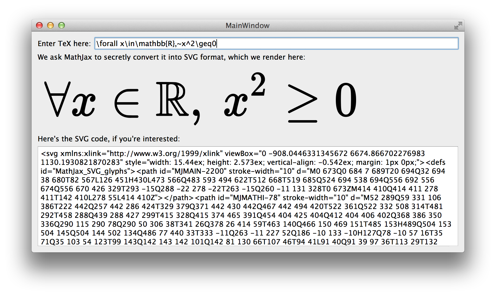

# Overview

*QtMathJax* is a `.pri` file that lets you easily add beautiful
math typesetting into any [Qt] application.

[MathJax] is the de facto standard for mathematical typesetting on
the web, using a JavaScript-based typesetting engine.
*QtMathJax* imports just the necessary parts of that project into
your Qt project, runs them in a hidden `QWebView`, and
provides you a one-function API for turning a string of TeX code
into a string of SVG code that can be used to render it anywhere,
[in your Qt app][qtsvg] or outside it.

# Obtaining

Just clone this git repo, or use it as a [submodule] in your
project.  In fact, it uses [MathJax] as a [submodule] itself.

# Usage

To use *QtMathJax*, follow these steps.

1. In your `.pro` file, import *QtMathJax* by adding the following
   line.
   ```
   include(/path/to/qtmathjax.pri)
   ```
2. In the source file where you need to use it, include the one
   class you need, `TeXEngine`, via `#include "texengine.h"`.
3. Create an instance of the class and call the `TeX2SVG()` method
   in it.

```
TeXEngine engine;  
// ...  
QString svgCode = engine.TeX2SVG( "ax^2+bx+c=0" );
```

That's it!  You can then render that SVG in any of
[the ways Qt provides][qtsvg], or do something else with it,
such as saving it to a file for use outside your app.  Example:

```
myQSvgWidget->load( svgCode.toUtf8() );
```

See below for an example app.

# Asynchronous

There is also an API for asynchronous computation, not yet
thoroughly documented here.  One calls ```engine.asyncTeX2SVG()```
to enqueue an expression for typesetting, then later checks back
using ```engine.hasComputed()``` to see if the typesetting is
complete.  If so, then a call to ```engine.TeX2SVG()``` will not
spin the event loop at all, but return immediately with a value
stored in cache from the asynchronous computation.  See the source
for details.

# Example

The repository comes with a sample app in the [example] subfolder.
If using Qt 5, you should be able to compile and run that app
without any changes needed.  It looks like this:



# License

This project is released under the [GPLv3] and [LGPLv3].
It is my understanding that these are both compatible with the
[Apache license] under which [MathJax] is released.

[Qt]: http://qt-project.org
[MathJax]: http://mathjax.org
[qtsvg]: http://qt-project.org/doc/qt-5.0/qtsvg/svgrendering.html
[submodule]: http://schacon.github.io/git/user-manual.html#submodules
[example]: ./example/
[GPLv3]: http://www.gnu.org/licenses/gpl-3.0.txt
[LGPLv3]: http://www.gnu.org/licenses/lgpl-3.0.txt
[Apache license]: https://github.com/mathjax/MathJax/blob/master/LICENSE

